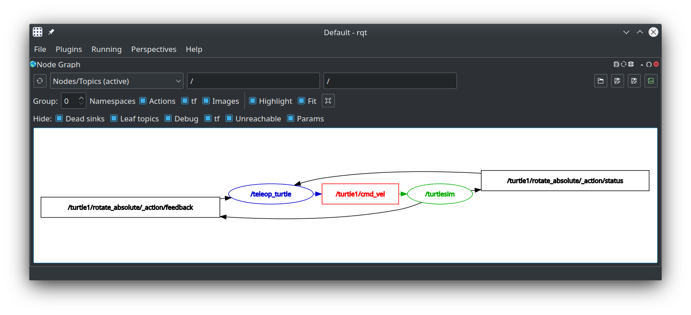
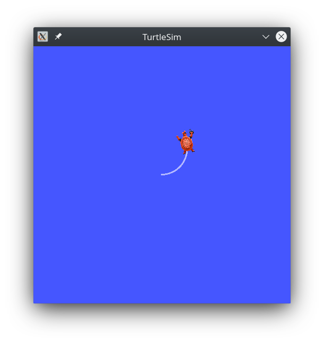
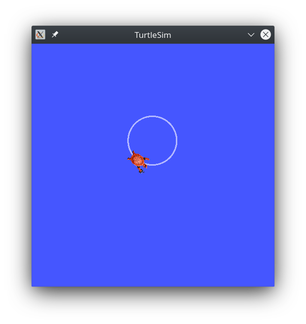
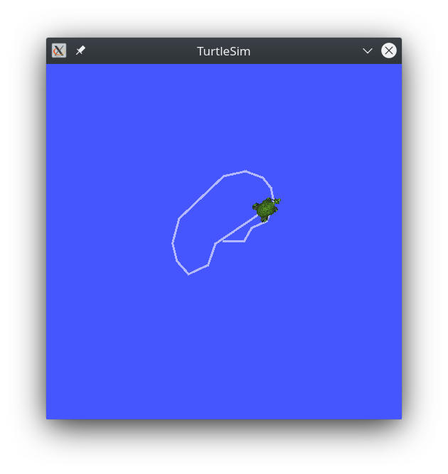
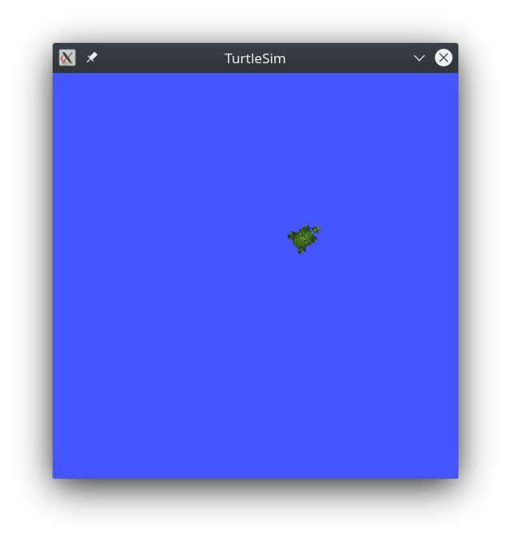
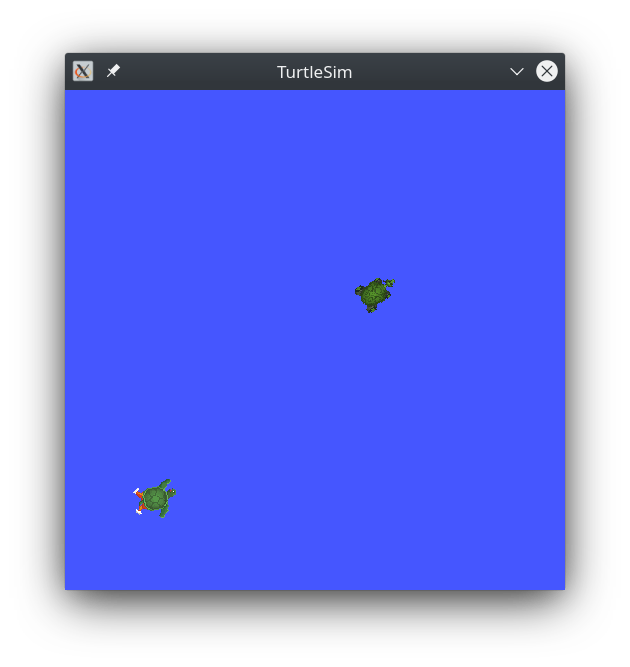
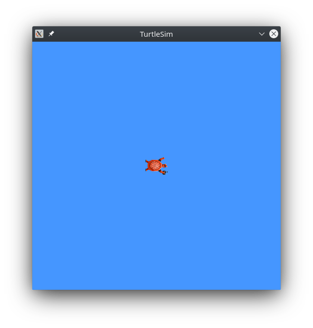

# Nodes, Topics, Services, Actions, and Parameters in ROS2
In this tutorial we'll go into detail on the core features of a ROS2 system and how they interact: **nodes**, **topics**, **services**, **actions**, and **parameters**.

## Nodes
As described in our overview, nodes are fundamental ROS 2 element that serves a single, modular purpose in a robotics system. Each node in ROS should be responsible for a single purpose (e.g. one node for controlling wheel motors, one node for controlling a laser range-finder, etc). Each node can send and receive data to other nodes via topics, services, actions, or parameters. A full robotic system is comprised of many nodes working in concert.

### Starting and Finding Nodes
In ROS2, a single executable (C++ program, Python program, etc.) can contain one or more nodes. These executables can be run using the command:
```
ros2 run <package_name> <executable_name>
```
where ```package_name``` is the name of the ROS2 package and ```executable_name``` is the name of the executable (e.g. ```turtlesim turtlesim_node```).

If turtlesim is not already running, go ahead and start it by using this command:
```
ros2 run turtlesim turtlesim_node
```

As we have done before, you can find nodes in a ROS2 system by using the command:
```
ros2 node list
```

If you open a new terminal (making sure to have the proper setup file sourced) and run ```ros2 node list``` you should see the name for our turtlesim node:
```
/turtlesim
```

### Remapping
In ROS2, remapping allows you to reassign default node properties, like node name, topic names, service names, etc., to custom values. In the last tutorial, you used remapping on ```turtle_teleop_key``` to change the default turtle being controlled.

To demostrate, we'll create a new ```turtlesim``` node remapped to have the new name ```/my_turtle```:
```
ros2 run turtlesim turtlesim_node --ros-args --remap __node:=my_turtle
```
If you run ```ros2 node list``` again, you'll see the new name:
```
/turtlesim
/my_turtle
```

### Getting More Information About a Node
Now that we can access the names of nodes in our system, we can get all sort of other useful information about the using the ```ros2 node info <node_name>``` command where ```node_name``` is the name of the node you want to look into. To examine our newly created ```/my_turtle``` node, execute the command:
```
ros2 node info /my_turtle
```
This command will return a list of subscribers, publishers, services, and actions (the ROS graph connections) that interact with that node. The output should look like this:
```
/my_turtle
  Subscribers:
    /parameter_events: rcl_interfaces/msg/ParameterEvent
    /turtle1/cmd_vel: geometry_msgs/msg/Twist
  Publishers:
    /parameter_events: rcl_interfaces/msg/ParameterEvent
    /rosout: rcl_interfaces/msg/Log
    /turtle1/color_sensor: turtlesim/msg/Color
    /turtle1/pose: turtlesim/msg/Pose
  Service Servers:
    /clear: std_srvs/srv/Empty
    /kill: turtlesim/srv/Kill
    /my_turtle/describe_parameters: rcl_interfaces/srv/DescribeParameters
    /my_turtle/get_parameter_types: rcl_interfaces/srv/GetParameterTypes
    /my_turtle/get_parameters: rcl_interfaces/srv/GetParameters
    /my_turtle/list_parameters: rcl_interfaces/srv/ListParameters
    /my_turtle/set_parameters: rcl_interfaces/srv/SetParameters
    /my_turtle/set_parameters_atomically: rcl_interfaces/srv/SetParametersAtomically
    /reset: std_srvs/srv/Empty
    /spawn: turtlesim/srv/Spawn
    /turtle1/set_pen: turtlesim/srv/SetPen
    /turtle1/teleport_absolute: turtlesim/srv/TeleportAbsolute
    /turtle1/teleport_relative: turtlesim/srv/TeleportRelative
  Service Clients:

  Action Servers:
    /turtle1/rotate_absolute: turtlesim/action/RotateAbsolute
  Action Clients:
```
You'll learn more about these connections and what they mean in the next sections.

## Topics
ROS 2 breaks complex systems down into many modular nodes. **Topics** are a vital element of the ROS graph that act as a bus for nodes to exchange messages. A node may publish data to any number of topics and simultaneously have subscriptions to any number of topics. Topics are one of the important ways that data moves between nodes, and therefore between different parts of the system.

Make sure turtlesim is running, and we can begin!

### Introspection Tools
In this section we'll get into using some introspection tools, as they will be helpful when learning about topics. The first introspection tool we'll use is one you're already aquainted with: rqt_graph. rqt_graph does visually what all of the command-line introspection tools do, but visually, so it will be a great backdrop for learning about them.

#### rqt_graph
First, open up rqt_graph in a new sourced terminal, set the ```group``` variable to 0, set the visibility to ```Nodes/Topics (active)``` from the drop down menu and hit the refresh button next to it. You should now see the following graph:


In the image above, the ovals or circles are nodes, and the rectangles are topics. If you hover your mouse over a node or topic, you'll see the highlighting like in the above picture. The blue indicates a ```publisher``` or sender on a particular topic, red indicates a topic/topic name, and green indicates a ```subscriber``` or reciever on the topic. This highlighting is important for dissecting large or complex systems. The graph is depicting how the /turtlesim node and the /teleop_turtle node are communicating with each other over a topic. The /teleop_turtle node is publishing data (the keystrokes you enter to move the turtle around) to the /turtle1/cmd_vel topic, and the /turtlesim node is subscribed to that topic to receive the data.

If you uncheck all of the boxes under the **Hide** section in rqt_graph, the topics in the graph should match those found when running ```ros2 topic list```, a command-line introspection tool (aside from the topics generated for the actions interface). For now though, leave these boxes checked to avoid confusion.

#### Echo
While we're already familiar with ```ros2 topic list```, we haven't encountered ```ros2 topic echo <topic_name>```, which allows the developer to see the data being published on a topic ```topic_name``` in real time! If we do this on the ```/turtle1/cmd_vel``` topic, we won't see anything at first, because nothing has been published on the topic while we've been looking at it. As soon as we make the turtle move, we should see some messages in the format:
```
linear:
  x: 2.0
  y: 0.0
  z: 0.0
angular:
  x: 0.0
  y: 0.0
  z: 0.0
  ---
```

#### Info
As we've seen before with the ```ros2 node info <node_name>``` command, the ```ros2 topic info <topic_name>``` command will show us some general information about a given topic. for example if you run ```ros2 topic info /turtle1/cmd_vel``` you should see the output:
```
Type: geometry_msgs/msg/Twist
Publisher count: 1
Subscriber count: 2
```
This illustrates that topics are not one-to-one only. There can be as many (reasonable) number of subscribers and publishers on a topic at any given time.

#### Interface Show
Nodes send data over topics using messages. Publishers and subscribers must send and receive the same type of message to communicate. by running the command ```ros2 topic list -t``` we can see that the topic ```/turtle1/cmd_vel``` is of the type ```geometry_msgs/msg/Twist```. We can get some more information on what these messages look like by using the ```ros2 interface show geometry_msgs/msg/Twist``` command which gives us the result:
```
# This expresses velocity in free space broken into its linear and angular parts.

    Vector3  linear
    Vector3  angular
```
If we then execute the command again, only this time as ```ros2 interface show geometry_msgs/msg/Vector3``` we'll get this output:
```
# This represents a vector in free space.

# This is semantically different than a point.
# A vector is always anchored at the origin.
# When a transform is applied to a vector, only the rotational component is applied.

float64 x
float64 y
float64 z
```
If you recall the data we saw when echoing the ```/turtle1/cmd_vel``` topic, you'll find this structure very familiar! Messages are defined in ```.msg``` files, using either other ROS2 message files or the [ROS2 primitive types](https://design.ros2.org/articles/interface_definition.html) to construct the message template. We'll learn a bit more about constructing messages in later tutorials.

#### Pub
Now that you have the message structure, you can publish data onto a topic directly from the command line using ```ros2 topic pub <topic_name> <msg_type> '<args>'``` with the topic name and type as arguments, and the ```'<args>'``` section the message you want to publish in [YAML](https://en.wikipedia.org/wiki/YAML) syntax, a format we'll be using a lot in ROS2. ```--once``` is an optional argument used to publish the message only once, then exit:
```
ros2 topic pub --once /turtle1/cmd_vel geometry_msgs/msg/Twist "{linear: {x: 2.0, y: 0.0, z: 0.0}, angular: {x: 0.0, y: 0.0, z: 1.8}}"
```
After entering the previous command, the turtle should have moved like so:


If we drop the ```--once``` tag and add ```--rate 1```, the command will publish our message at a rate of 1 HZ (once per second), causing the turtle to move in a circle:


#### Hz
The last introspection tool we'll be looking at is ```ros2 topic hz <topic_name>```, which reports the rate at which data on the topic is being published. If we use this command on the ```/turtle1/pose``` topic we'll see:
```
average rate: 62.509
    min: 0.015s max: 0.016s std dev: 0.00038s window: 64
```
which gives us some statistics on the rate data is being published on that topic. This is especially useful when dealing with networked or [multi-agent](https://en.wikipedia.org/wiki/Multi-agent_system) systems, as network interference or slowdown can cause weird or unforseen issues on a ROS2 system.

## Services
Services are another method of communication for nodes in ROS2. Services, much like function calls in most modern programming languages, are based on a call-and-response model, versus topics’ publisher-subscriber model. While topics allow nodes to subscribe to data streams and get continual updates, services only provide data or perform actions when they are specifically called by a client. There can be many clients using the same service, however there can only be one server for each service.

Make sure turtlesim is still running and we can begin!

### Service Types
Services have types that describe how the request and response data of a service is structured. Service types are defined similarly to topic types, except service types have two parts: one message for the request and another for the response. You can think of this structure like the parameters and return values in a function call, the input parameters are some pieces of data the server needs to perform the call, and the return value is something the client may find useful, or just an indication of success/failure.

To learn a bit more about service types and how they're structured, lets take a look at using the ```ros2 service type <service>``` command to find the type of a particular service, and the ```ros2 interface show <type_name>.srv``` command to show how it's structured. Of course, as will all of these introspection commands, you can use the ```rqt``` tool to use them graphically instead of via the command line.

In this section we'll use the ```/clear``` and ```/spawn``` services as examples. if you execute the command ```ros2 service type /clear``` you should see ```std_srvs/srv/Empty``` as the output. The ```Empty``` service type look exactly as it sounds, it carries no data, and is intended to be used to call services which require no data/parameters. When you execute ```ros2 interface show std_srvs/srv/Empty.srv``` you'll see the following output, which gives us a reference for how service types/.srv files are structured:
```
---
```

When we compare that to the output of ```ros2 interface show turtlesim/srv/Spawn.srv``` (where ```turtlesim/srv/Spawn``` is the output of ```ros2 service type /spawn```):
```
float32 x
float32 y
float32 theta
string name # Optional.  A unique name will be created and returned if this is empty
---
string name
```

we can see that service types are seperated into two categories: call data and return data. They are seperated by a line with only ```---```, with the call data above the line, and the return data below. ROS2 packages this structure into b```.srv``` files, much like message types, and we'll learn how to generate our own service types a little later on using these files.

### Calling Services
Now that we know all about service types and how they're defined, we can move on to how services are called. Usually, in a ROS2 system, services are called between nodes using the ROS2 CLient Libraries, however in this example we'll be using the command-line tool ```ros2 service call <service_name> <service_type> <args>``` to call some services.

First we'll call the ```/clear``` command, as you can see because it has no data structure to fill out, we can leave the arguments blank:
```
ros2 service call /clear std_srvs/srv/Empty
```
This service call will clear the turtlesim window of any lines your turtle has drawn:
Before            |  After
:-------------------------:|:-------------------------:
  |  

Next, we can spawn a new turtle by calling the ```/spawn``` service and inputting it's arguments. As before with publishing to topics, the arguments are the message format in YAML syntax, for calling a service, you only need to define the `call` part of the service type:
```
ros2 service call /spawn turtlesim/srv/Spawn "{x: 2, y: 2, theta: 0.2, name: ''}"
```
Your turtlesim window will update with the new turtle!



## Parameters
A parameter is a configuration value of a node. You can think of parameters as node settings or variables. A node can store parameters as integers, floats, booleans, strings and lists. In ROS 2, each node maintains its own parameters. All parameters are dynamically reconfigurable, and built off of ROS 2 services.

Make sure turtlesim is still running and we can begin!

### Viewing Parameters and their Values
We can use the ```ros2 param list``` commmand to, wait for it, list the parameters of currently running nodes! If we run this command in the current environment, we'll see the following output:
```
/teleop_turtle:
  scale_angular
  scale_linear
  use_sim_time
/turtlesim:
  background_b
  background_g
  background_r
  use_sim_time
```
The parameters are listed below the node subnamespace they belong to. Notice that `use_sim_time` is a parameter for both nodes, this is because every node in ROS2 has the `use_sim_time` parameter, which is a parameter that signals what time source the node is using (system time, or simulated ROS Time). The way ROS2 handles time is a complicated topic, so we won't get into it here, but if you would like a bit more reading on it, you can see the ROS2 design article on [Clock and Time](https://design.ros2.org/articles/clock_and_time.html).

Moving on, To get the type and value of a parameter, you can use the command ```ros2 param get <node_name> <param_name>```. If we use this command for the background_g variable in turtletsim, we'll get the output:
```
Integer value is: 86
```
Which will tell us that particular parameter is an integer, and its value is 86 (0-255 RGB scale). We can also change this parameter to a new value using the command ```ros2 param set <node_name> <param_name> <param_value>```, lets set it's new value to 150, we should see the output ```Set parameter successful```, and the background should change to a lighter blue hue.Setting parameters with the set command will only change them in your current session, not permanently. However, you can save your settings changes and reload them next time you start a node.



### Saving and Loading parameters
You can “dump” all of a node’s current parameter values into a file to save for later using the command ```ros2 param dump <node_name>```. As with all ROS2 commands, you can use the `-h` flag on it to see any extra options, in this case you can use `--output-dir <dir_name>` to specify an output directory for you parameter file to live. As is common, these parameters are saved in a YAML format file with the node name as the file name e.g. `turtlesim.yaml`. 

To load these parameter files, you can run the specified node with these arguments:
```
ros2 run <package_name> <executable_name> --ros-args --params-file <file_name>
```
Where `<file_name>` is the path to the parameter file.

## Actions
Actions are another one of the communication types in ROS 2, and are intended for long running tasks. They consist of three parts: a goal, a result, and feedback. Actions are built on topics and services. Their functionality is similar to services, except actions are preemptable (you can cancel them while executing). They also provide steady feedback, as opposed to services which return a single response.

Actions use a client-server model, similar to the publisher-subscriber model described in the topics section. The “action client” node sends a goal to an “action server” node that acknowledges the goal and returns a stream of feedback and a result.

Make sure you've still got turtlesim running, and lets begin!

### Actions in Turtlesim
As we noted earlier on in this chapter, the turtlesim node happens to include some actions that we can utilize ourselves. When you launch the `/teleop_turtle` node, you will see the following message in your terminal:
```
Use arrow keys to move the turtle.
Use G|B|V|C|D|E|R|T keys to rotate to absolute orientations. 'F' to cancel a rotation.
```
This second line is referring to a series of actions that you can use to rotate the turtle to select absolute orientations. Pay attention to the terminal where the `/turtlesim` node is running. Each time you press one of these keys, you are sending a goal to an action server that is part of the /turtlesim node. The goal is to rotate the turtle to face a particular direction. A message relaying the result of the goal should display once the turtle completes its rotation:
```
[INFO] [turtlesim]: Rotation goal completed successfully
```
The `F` key will cancel a goal mid-execution, demonstrating the preemptable feature of actions. Try pressing the `C` key, and then pressing the `F` key before the turtle can complete its rotation. In the terminal where the `/turtlesim` node is running, you will see the message:
```
[INFO] [turtlesim]: Rotation goal canceled
```
Not only can the client-side (your input in the teleop node) preempt goals, but the server-side (the `/turtlesim` node) can as well. When the server-side preempts an action, it “aborts” the goal. Try hitting the `D` key, then the `G` key before the first rotation can complete. In the terminal where the `/turtlesim` node is running, you will see the message:
```
[WARN] [turtlesim]: Rotation goal received before a previous goal finished. Aborting previous goal
```
Telling us that the server-side aborted the goal because it was interrupted. This is an important concept because it shows us that action servers don't have a "queue" of actions, the client should wait until the previous goal has finished before requesting a new goal.

### Using Actions
Much like in previous sections, we can do a bit of introspection on actions using commands like `ros2 action list` (which lists the currently available actions) and `ros2 action info <action_name>` will show some useful information about an action. For example, when we execute the command `ros2 action info /turtle1/rotate_absolute` we'll get the following output:
```
Action: /turtle1/rotate_absolute
Action clients: 1
    /teleop_turtle
Action servers: 1
    /turtlesim
```
Displaying the action name, client nodes, and server nodes.

Much like topics and services, we can also use the command `ros2 interface show <interface location>` to show the format of actions, which are defined in `.action` files with the same syntax as message and service files. For example, if we use the `ros2 action list -t` command, we can see that the action `/turtle1/rotate_absolute` has the type `turtlesim/actions/RotateAbsolute`. So if we use the command `ros2 interface show turtlesim/action/RotateAbsolute.action`, the following output will be printed to the terminal:
```
# The desired heading in radians
float32 theta
---
# The angular displacement in radians to the starting position
float32 delta
---
# The remaining rotation in radians
float32 remaining
```

With the first section (above the first `---`) defining the structure of the goal, the second defining the structure of the result, and the third defining the structure of the feedback.

Now that we know how the action message is structured, we can use the `ros2 action send_goal <action_name> <action_type> <values>` command to send goals to turtlesim manually! As with topics and services, the `<values>` is the structure of the goal in YAML syntax. Say we want to have our turtle pointing straight up and down, we could use:
```
ros2 action send_goal /turtle1/rotate_absolute turtlesim/action/RotateAbsolute "{theta: 1.57}"
```
which sends a goal to the action service with a "theta" value of 1.57 radians. You should then see some output similar to this:
```
Waiting for an action server to become available...
Sending goal:
   theta: 1.57

Goal accepted with ID: f8db8f44410849eaa93d3feb747dd444

Result:
  delta: -1.568000316619873

Goal finished with status: SUCCEEDED
```
Which has the goal, goal ID, result and result status. The goal ID is simply a unique identifier for that goal, the result is a "delta" value which shows the angular displacement of the turtle in radians, and the result status is used by the action client to tell if the goal SUCCEEDED, FAILED, etc. If you would like to also view the feedback for the action, you can use the `--feedback` option:
```
ros2 action send_goal /turtle1/rotate_absolute turtlesim/action/RotateAbsolute "{theta: -1.57}" --feedback
```
Which will return output similar to this:
```
Sending goal:
   theta: -1.57

Goal accepted with ID: e6092c831f994afda92f0086f220da27

Feedback:
  remaining: -3.1268222332000732

Feedback:
  remaining: -3.1108222007751465

…

Result:
  delta: 3.1200008392333984

Goal finished with status: SUCCEEDED
```
With the feedback arriving in between the goal ID and the result. Feedback is recieved at whatever interval is set by the server until the goal is complete.

## Next Steps
before moving on to the workspace and programming tutorials, you should first work through the [common tools](common_tools.md) section, which provides a quick overview of other common tools in ROS2.