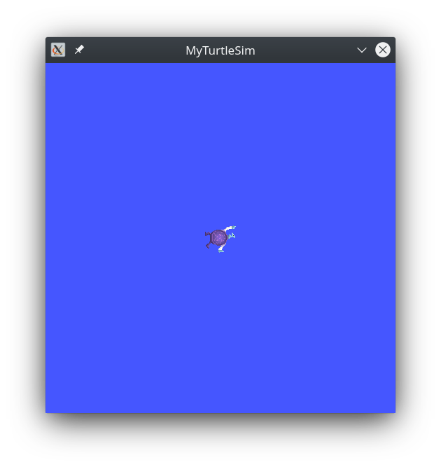
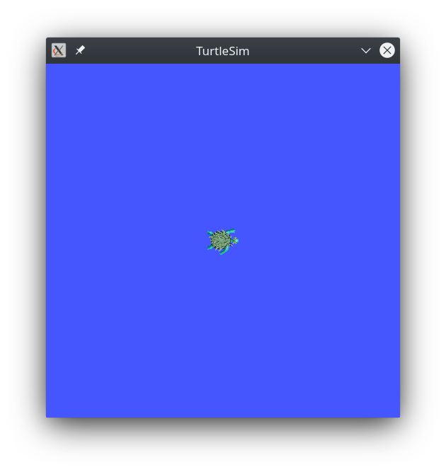

# An overview of ROS2 Workspaces and Packages
In this tutorial, we'll create our first ROS2 workspace and package. A workspace is a directory containing ROS 2 packages, which aid in managing dependancies for said packages, and help to isolate project-specific dependancies from one another.

Whenever you source your ROS2 setup file (or run your "ros2init" alias), you're really sourcing the "main" or "installation" ROS2 workspace, which contains all of the standard packages, and any additional packages you've downloaded through `apt` or a similar package manager.

You also have the option of sourcing an “overlay” – a secondary workspace where you can add new packages without interfering with the existing ROS 2 workspace (or “underlay”) that you’re extending. Your underlay must contain the dependencies of all the packages in your overlay. Packages in your overlay will override packages in the underlay. It’s also possible to have several layers of underlays and overlays, with each successive overlay using the packages of its parent underlays. 

Much in the way that you would create [layers of abstraction](https://en.wikipedia.org/wiki/Abstraction_layer) when writing software, workspaces allow robotics developers to create layers of ROS2 packages which implement increasingly complex operations, while maintaining clean code and clean workspaces (not cluttered or overrun with 100s or 1000s of packages).

## Prerequisites
Before we begin, source your ROS2 setup file. Check if `colcon` is installed by running:
```
colcon version-check
```
your output should look like this:
```
colcon-argcomplete 0.3.3: up-to-date
colcon-bash 0.4.2: up-to-date
colcon-cd 0.1.1: up-to-date
colcon-cmake 0.2.23: newer version available (0.2.24)
colcon-core 0.5.10: newer version available (0.6.0)
colcon-defaults 0.2.5: up-to-date
colcon-devtools 0.2.2: up-to-date
colcon-library-path 0.2.1: up-to-date
colcon-metadata 0.2.4: up-to-date
colcon-notification 0.2.13: up-to-date
colcon-output 0.2.11: up-to-date
colcon-package-information 0.3.3: up-to-date
colcon-package-selection 0.2.7: newer version available (0.2.8)
colcon-parallel-executor 0.2.4: up-to-date
colcon-pkg-config 0.1.0: up-to-date
colcon-powershell 0.3.6: up-to-date
colcon-python-setup-py 0.2.5: newer version available (0.2.6)
colcon-recursive-crawl 0.2.1: up-to-date
colcon-ros 0.3.18: newer version available (0.3.19)
colcon-test-result 0.3.8: up-to-date
colcon-zsh 0.4.0: up-to-date
```
If you receive an error run the following command to install `colcon`:
```
sudo apt install python3-colcon-common-extensions
```
Once `colcon` is installed ensure that git is installed by running:
```
git --version
```
If you receive an error follow [this tutorial](https://git-scm.com/book/en/v2/Getting-Started-Installing-Git) to install git.

After ensuring git is installed, run the `rosdep` command if you recieve an error follow [this tutorial](https://wiki.ros.org/rosdep#Installing_rosdep). Once all of that is completed you are ready to create your first workspace.

## Creating and Building a Workspace
Best practice is to create a new directory for every new workspace. We would recommend keeping your ROS2 workspace directories in a central directory, so if you don't already have a place to keep them, create one! The name doesn’t matter, but it is helpful to have it indicate the purpose of the workspace. Let’s choose the directory name `tutorial_ws`, for "tutorial workspace”:
```
mkdir -p tutorial_ws/
cd tutorial_ws/
```
Also create another directory called `src` and navigate into it. Generally, ROS2 packages should be placed in the `src` directory of the workspace.

In the rest of these tutorials, you'll create your own packages, but for now you will practice putting a workspace together using existing packages.

The existing packages you will use are from the `ros_tutorials` repository (repo). After going through previous tutorials, you’ll be familiar with turtlesim, one of the packages in this repo.

While inside the `src` directory clone the `ros_tutorials` git repository:
```
git clone https://github.com/ros/ros_tutorials.git -b foxy-devel
```
Now you have populated your workspace with a sample package, but it isn’t a fully-functional workspace yet. You need to resolve dependencies and build the workspace first.

### Resolving dependencies
With files in your `src` folder we can start creating a fully functional workspace. We begin by resolving the dependencies in our packages. In ROS2 a dependency (much like in most of software development) is a package of software that we need to have available in order for software we are using or developing to work as intended. Dependency resolution ensures we have all the files we need to build our workspace. 
 
Using the `rosdep` command, we can automatically install all the dependencies that our packages need. From the root of your workspace (`tutorial_ws/`), run the following command:
```
rosdep install --from-paths src --rosdistro foxy -y
```
Packages declare their dependencies in the `package.xml` file (you will learn more about packages in the next section). This command walks through those declarations and installs the ones that are missing. If `rosdep` ran correctly you should see the following output:
```
#All required rosdeps installed successfully
```
 
Now that all dependancies are met, you will be able to build your workspace with the ROS2 build tool: `colcon`.

### Building your Workspace
To build your workspace run the following command in the `tutorial_ws` directory:
```
colcon build
```
Other useful arguments for colcon build:

- `--packages-up-to` builds the package you want, plus all its dependencies, but not the whole workspace (saves time)

- `--symlink-install` saves you from having to rebuild every time you tweak python scripts

- `--event-handlers console_direct+` shows console output while building (can otherwise be found in the log directory)

Once the build is finished list the contents of the directory. You will see:
```
build  install  log  src
```
The `install` directory will contain your workspace's setup files, which you can use to source the workspace as an "overlay" of your ROS2 installation. The `build` directory contains built packages, and the `log` directory contains useful log data generated by `colcon`.

### Sourcing your Workspace
Before sourcing the overlay, it is very important that you open a new terminal, separate from the one where you built the workspace. Sourcing an overlay in the same terminal where you built, or likewise building where an overlay is sourced, may create complex issues.

In the new terminal, source your main ROS 2 environment as the “underlay”, so you can build the overlay “on top of” it, navigate to your `tutorial_ws` directory in the new terminal, and source your newly built workspace:
```
source install/local_setup.bash
```
`local_setup.bash` only adds the packages available in the current overlay to the environment, to source the current overlay and its underlays use `setup.bash`. So, sourcing your main ROS 2 installation’s `setup.bash` and then the `tutorial_ws` overlay’s `local_setup.bash`, like you just did, is the same as just sourcing `tutorial_ws`’s `setup.bash`, because that includes the environment of the underlay it was created in.

You will now be able to run `turtlesim`, but how do we know we're running the turtlesim package we just built instead of the one in the main ROS2 installation? Well, we can modify and rebuild turtlesim, and then test it out! 

### Modifying the Overlay

To test if you are using your newly created workspace, lets change the title of the Turtlesim window. Navigate to:
```
tutorial_ws/src/ros_tutorials/turtlesim/src/
```
open the `turtle_frame.cpp` file and edit line 52 to say:
```
setWindowTitle("MyTurtleSim");
```
and rebuild the workspace using the terminal you used to run `colcon build` the first time. Now you can return to the terminal where you have the workspace sourced and run `ros2 run turtlesim turtlesim_node`. It should have "MyTurtleSim" for the title of the window. To show that our "underlay" is still the same, open a new window, source your ROS2 setup file, and run `turtlesim` there, you should see the window still says "TurtleSim".

Overlay            |  Underlay
:-------------------------:|:-------------------------:
  |  

## Creating Your First ROS2 Package
Packages are containers for your ROS2 code. They allow you to share and install your code.

### Package essentials
In order to make a package, you need to have a `package.xml` file containing the meta information about your package and the `CMakeLists.txt` file that describes how to build the code within the package. The simplest package structure possible is:
```
my_package/
  CMakeLists.txt
  package.xml
```
A single workspace can contain as many packages as you want, each in their own folder. You can also have packages of different build types in the same workspace, but you can not have nested packages.

### Creating a package
Navigate into the **dev_ws** directory with `cd ~/dev_ws/src`. To create a ROS2 package run the following command:
```
ros2 pkg create --build-type ament_cmake <package_name>
```
You will now have a folder in **src** called *my_package*. Build the workspace with the new package and source the workspace. Run the executable created using the __*--node-name*__ argument:
```
ros2 run my_package my_node
```
You should see the following message in the terminal:
```
hello world my_package package
```
Navigate into **my_package** using `cd ~/dev_ws/src/my_package` and display the contents with `ls`. You should see:
```
CMakeLists.txt  include  package.xml  src
```
The definition for **my_node** is in the **src** folder. You will place all your custom nodes into this folder.

## Next Steps
Now that you can create your own workspace and packages, it is time to make custom [publishers and subscribers](pub_sub.md).