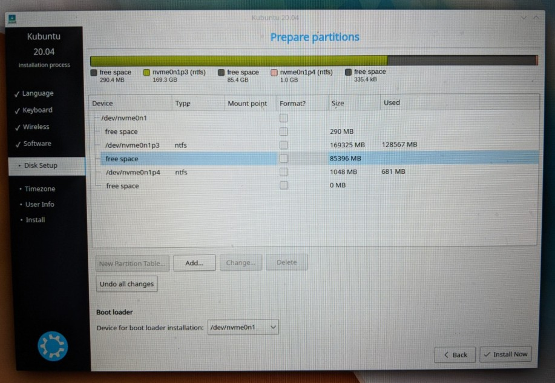
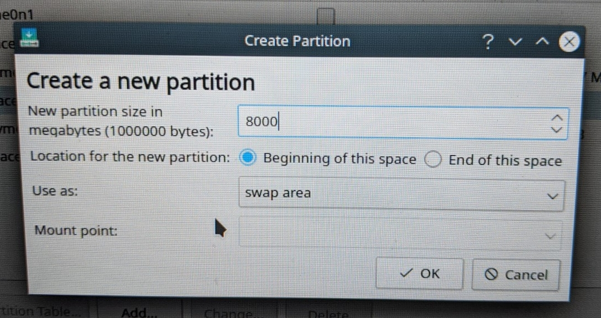
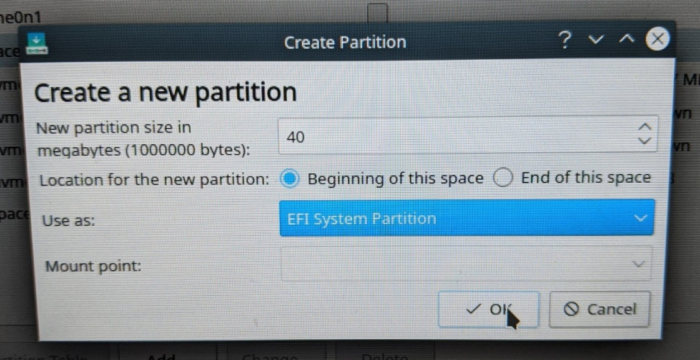
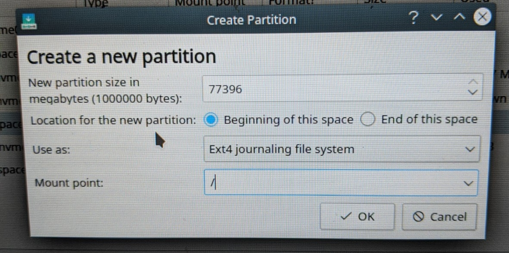

# Introduction
In this introduction we''ll go from installing Ubuntu Linux on your given system to getting ROS2 set up and ready for the rest of this training series.
## Installing Ubuntu
ROS and ROS2 are designed to run on Linux, particularly the Ubuntu distribution of Linux which is popular and generally very user-friendly. We'll be using Ubuntu 20.04 LTS as it is the latest LTS version with a compatible LTS ROS2 distribution (Foxy). This guide is going to assume you either a) Have a computer already running Windows 10 or b) Have a completely clean computer with no Operating Systems installed yet, and have a Windows 10/MacOS/Linux PC available nearby. If you instead have an exsisting MacOS installation, please refer to [this]() guide instead, and if you already have Linux installed on your current machine, you probably don't need this guide (although if you do, please feel free to open an issue or pull request!). 
### Creating installation media
To install Ubuntu 20.04 LTS, you'll need a USB flash drive with at least 8 GB of storage. Make sure to back up any important files from this drive before you attempt to install Ubuntu, as the drive **will** be formatted completely when creating the installation media.
#### Choosing an Ubuntu flavor
Ubuntu comes in many different *flavors* which change the look and feel of the desktop experience. The default distribution found [here](https://ubuntu.com/download/desktop/thank-you?version=20.04&architecture=amd64) is usually suitable for most people, however if you're running older hardware or would like more customization options [Xubuntu](https://xubuntu.org/download/) is a great flavor, and what we'll be using on all of our ROS-enable robots. If you want a more "clean" or "modern" looking desktop [Kubuntu](https://kubuntu.org/getkubuntu/) is the flavor for you, with a serious Windows vibe (and even a MacOS theme), and some of the best included software/utilities of the bunch. Once you've chosen a flavor, simply download the lastest ISO release, and prepare to flash your USB! Note: some of the downloads require a *torrent client* which allows users to distribute files without a dedicated server. To handle torrent links, we recommend [qBittorrent](https://www.qbittorrent.org/download.php).
### Flashing the USB on Windows
On Windows we'll use the small executable application [Rufus](https://rufus.ie/) to flash our USB with the ISO file we just downloaded. Once you have Rufus downloaded, follow [these](https://ubuntu.com/tutorials/create-a-usb-stick-on-windows#4-boot-selection-and-partition-scheme) instructions to flash the USB.
### Flashing the USB on MacOS
Make sure important files are backed up, and the USB is plugged in, then follow [this](https://ubuntu.com/tutorials/create-a-usb-stick-on-macos#3-prepare-the-usb-stick) guide.
### Flashing the USB on Linux
Make sure important files are backed up, and the USB is plugged in, then follow [this](https://ubuntu.com/tutorials/create-a-usb-stick-on-ubuntu#3-launch-startup-disk-creator) guide.
### Installing on a 'clean' system
Installing Ubuntu to a "clean" (without OS) system is very simple, just plug in your flashed USB, and select it as the boot dive in your manufacturers BIOS boot settings, which you can usually get into by restarting your computer and hitting the "delete" or "F11" keys when the manufacturer slash comes up, then follow the on-screen instructions for installation. When installation is finished, simply change your boot settings to the drive you installed Linux on, and restart the computer!
### Duel-booting alongside Windows 10 (on the same drive)
The most convenient way to install Ubuntu 20.04 LTS on your Windows machine is to install it alongside your exsisting Windows installation in what's called a "duel-boot" configuration, where when your PC starts up, you can select to go into Ubuntu or Windows 10, and switch between them at any time simply by restarting the computer. Now, of course you can "take the red pill" so to speak by switching completely to Linux, a guide on how to do that can be found [here](https://www.pcmag.com/how-to/how-to-make-the-switch-from-windows-to-linux). However, it is always nice to be able to go back to something familiar, which is why we suggest the duel-boot approach (along with software availability in things like gaming, CAD, productivity, etc.).
#### Freeing up space on your boot drive
In order to be able to install linux in the same drive as Windows, you'll need to free up some space on the drive in windows, to do this you'll want to follow [this](https://www.diskpart.com/articles/how-to-create-unallocated-space-0708i.html) guide. You'll want to have **At least 40 GB** of space available for Ubuntu, and we recommend more than that if you want to use Ubuntu for more than just ROS (100-150 GB). While you're still in Windows, take note of how much RAM your particular system has (Open up File Explorer, right click on "this computer", and select "properties").
#### Installation
Once you have an appropriate amount of unallocated space on your boot drive, plug in your USB boot media we created earlier, restart your computer, and press either "delete" or "F11" (or something similar) to enter your manufacturers BIOS, where we'll change the boot order to put the USB stick at the top. Been awake for a day and a half. Plan to go to bed soon. Thanks for asking though. Maybe later on. @piss baby

Message #shitposting
 media installation screen. When you get to the "installation type" screen you should select "something else" or "Manual" as we'll be doing a bit of a custom installation.

When you select "something else" or "Manual" you'll be taken to a rather complicated looking screen like this:


From here you'll want to create a few new partitions in the newly unallocated space (In this case its the 85396 MB space). The first will be your "swap" partition which will be used as RAM if your physical RAM is completely taken up, this prevents major system crashes and slowdowns cause by high RAM consumption, an essential for some of the work we'll be doing in ROS2. As shown below, you'll want you click on "add" and select the "swap" option under "use as". Size this partition to the amount of physical RAM you have in your system (In this case 8 GB or ~8000 MB).


If your Windows install is UEFI-based, then you'll want to create a "efi" partition as shown below, otherwise don't worry about it, and move on two the next step. Make sure this partition is around 550 MB in size, this ensures the UEFI bootloader will be able to fit.


Finally, you'll create the partition Ubuntu will reside in, use the the rest of your remaining free space, select a ext4 file system in the "use as" menu, and select "/" as the mount point


After that, simply follow the on-screen instructions and you've successfully installed some flavor of Ubuntu 20.04! Go back into your BIOS and select your boot drive as the default option (and 'ubuntu' if you installed with UEFI). If you run into any issues with GRUB (The bootloader for linux which should provide you with the option to choose between windows and linux) not recognizing Windows 10, follow [this](https://askubuntu.com/questions/197868/grub-does-not-detect-windows) guide. If you have any other issues, feel free to reach out or start an issue on this repository!

## Installing ROS/ROS2
Once you've got Ubuntu up and running, we can begin installing ROS and ROS2. Although the objective of this training series is to learn ROS2, sometimes we'll need to dip back into good ol' ROS(1) to use certain packages, and its generally a good idea to have both installed on your system, in case you need to use a ROS(1) package that hasn't been ported to ROS2 yet, or have some other specific need for a project. With that said, we'll install ROS(1) first by following [this](https://askubuntu.com/questions/197868/grub-does-not-detect-windows) guide, then install ROS2 using [this](https://index.ros.org/doc/ros2/Installation/Foxy/Linux-Install-Debians/) guide. Make sure to do the full desktop install for both distributions, and install the ros1-bridge package for ROS2, as we'll need it to communicate with ROS(1) nodes. Also make sure you install "argcomplete" to ensure autocompletion works for ROS.

## Setting up a Working Environment
Once you have ROS(1) and ROS(2) fully installed, we can start setting up our working environment. In order to work with ROS(1)/ROS2 systems and commands, you'll need to have the setup script "sourced" or added to your terminal environment. While you could remember the path to your setup script and source it each time you open a terminal window, we recommend setting up an alias or alias' to do this for you in your ~/.bashrc (or similar) such as:

```bash
alias rosinit="source /opt/ros/noetic/setup.bash" 
alias ros2init="source /opt/ros/foxy/setup.bash"
```
Just note that if you want to switch between working in ROS(1) and ROS2, you'll need to restart your terminal and reinit with the correct alias. You cannot and should not have ROS(1) and ROS2 commands sourced at the same time, this sometimes causes complications.

After you've set up your alias', find a good place to store all of your ROS2 work. In later tutorials, you'll need to create new ROS2 workspaces, and having a central place to keep them is recommended.

While not required, it is recommended to use a terminal emulator that supports tiling or tabbing. When working on ROS2 systems, its usually very useful to have multiple terminal sessions open at the same time, and having a terminal emulator that can handle it gracefully is essential. We recommend using either [GNOME Terminator](https://github.com/gnome-terminator/terminator#readme) or [Konsole](https://konsole.kde.org/).

## Next Steps
After you've gotten comfortable in your ROS2 working environment, move on to the [turtlesim/rqt tutorial](turtlesim_rqt.md) to get an overview of key ROS2 concepts!