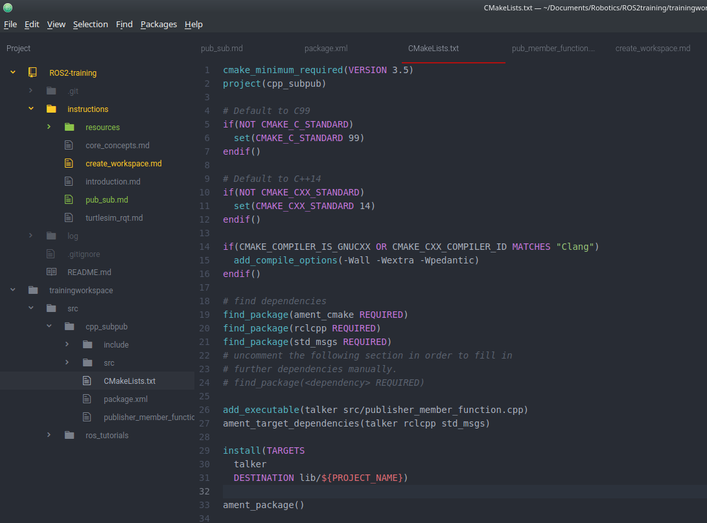

# Creating a Publisher and Subscriber
I this tutorial we will create our first Publisher and Subscriber.

## Prerequisites
[TODO] talk about C++ as our main language, gennerally using C++ for anything that needs to be even remotely "performant" or "realish-time" and using Python as a "scripting" language for quick tasks/nodes that don't necessarily need to perform tons of operations.

## Writing Nodes
Start by creating a new ROS2 package in the **dev_ws** workspace called `cpp_pubsub`, remember to put packages in the **src** directory:
```
ros2 pkg create --build-type ament_cmake cpp_pubsub
```
After package verification navigate to `dev_ws/src/cpp_pubsub/src`. Download the example code using the following command:
```
wget -O publisher_member_function.cpp https://raw.githubusercontent.com/ros2/examples/master/rclcpp/topics/minimal_publisher/member_function.cpp
```
List the files in the directory, you should see a file named `publisher_member_function.cpp`. Open the file in your preferred text editor.


At the top of the file you see the packages that need to be included to write this node. __*chrono*__ and __*memory*__ are apart of the standard C++ libraries. __*rclcpp/rclcpp.hpp*__ and __*std_msgs/msg/string.hpp*__ are ROS dependencies and will be added to the **package.xml** file later in the tutorial. The ROS dependencies include the built-in message types we will use to publish data. If you would like to see a list of the message types click [here](https://index.ros.org/p/std_msgs/).

After the include statements a class created that inherits the `rclcpp::Node` class. The constructor for the **MinimalPublisher** class creates a **Node** object named `minimal_publisher` and initializes ```count_```, defined in the **private** section of the class deceleration line 47, to 0.
```
MinimalPublisher(): Node("minimal_publisher"), count_(0)
```
Inside the constructor body, the `publisher_`,defined in the **private** section of the class deceleration line 46, variable is initialized with a **String** type and given the name **topic** and queue size limit in the case of backup:
```
publisher_ = this->create_publisher<std_msgs::msg::String>("topic", 10);
```
After the publisher initialization a timer initialized,defined in the **private** section of the class deceleration line 45. To call the `timer_callback()` method, defined in the **private** section of the class deceleration line 38, twice a second. Message data is sent to the `timer_callback` function and published from there:
``` C++
void timer_callback()
  {
    auto message = std_msgs::msg::String(); // Creates a ROS2 string to hold the message
    message.data = "Hello, world! " + std::to_string(count_++); // Increments count_ and appends it to the message data
    RCLCPP_INFO(this->get_logger(), "Publishing: '%s'", message.data.c_str()); // Ensures every message it published to the console
    publisher_->publish(message); // Publishes the message
  }
```
Following the class deceleration is the main function, where the node actually executes. `rclcpp::init` initializes the ROS2 and `rclcpp::spin` starts processing data from the node, including callbacks from the timer.

## Adding Dependencies
Navigate into back into the `cpp_pubsub` directory, where the `CMakeLists.txt` and `package.xml` files have been created. Open `package.xml` in your text editor. After the `ament_cmake` line add the following:
```
<depend>rclcpp</depend>
<depend>std_msgs</depend>
```
This will declare the package needs `rclcpp` and `std_msgs` to run.

After editing `package.xml` open the `CMakeLists.txt` and add the following below ``` find_package(ament_cmake REQUIRED)```:
``` CMakeLists
find_package(rclcpp REQUIRED)
find_package(std_msgs REQUIRED)
```
After adding the dependencies add the executable and name it talker so you can run your node using `ros2 run`:
```CMakeLists
add_executable(talker src/publisher_member_function.cpp)
ament_target_dependencies(talker rclcpp std_msgs)
```
Add the install target section so `ros2 run` and find your executable:
``` CMakeLists
install(TARGETS
  talker
  DESTINATION lib/${PROJECT_NAME})
```
Your `CMakeLists.txt` should look like this one completed:


## Writing a Subscriber
Navigate into the `dev_ws/src/cpp_pubsub/src` directory run the following command to get the practice files:
```
wget -O subscriber_member_function.cpp https://raw.githubusercontent.com/ros2/examples/master/rclcpp/topics/minimal_subscriber/member_function.cpp
```
Listing the files in the directory should now show:
```
publisher_member_function.cpp  subscriber_member_function.cpp
```
Open `subscriber_member_function.cpp` with your text editor. The subscriber's code is very similar to the publisher's code, the **Node** name is now "minimal_subscriber" and the constructor uses **Node's** __*create_subscription*__ class to execute callback. A timer is not created because the subscriber simply responds whenever data is published to the topic. The topic name and type used in the publisher and subscriber must match.
``` C++
MinimalSubscriber()
  : Node("minimal_subscriber") // Node is created and given the name "minimal_subscriber"
  {
    subscription_ = this->create_subscription<std_msgs::msg::String>(
    "topic", 10, std::bind(&MinimalSubscriber::topic_callback, this, _1)); // Subscription to topic is created
  }
```

The subscription uses the `topic_callback()` method, defined in the private section of the declaration line 32:
``` C++
void topic_callback(const std_msgs::msg::String::SharedPtr msg) const
  {
    RCLCPP_INFO(this->get_logger(), "I heard: '%s'", msg->data.c_str()); // Outputs message to console
  }
  rclcpp::Subscription<std_msgs::msg::String>::SharedPtr subscription_; // Subscription variable definition
```

The main function is the same as the publisher, except it spins `MinimalSubscriber` instead of `MinimalPublisher`. The dependencies are the same as `MinimalPublisher` so no changes need to be made to `package.xml`. Reopen `CMakeLists.txt` and add the following lines:
``` CMakeLists
add_executable(listener src/subscriber_member_function.cpp)
ament_target_dependencies(listener rclcpp std_msgs)

install(TARGETS
  talker
  listener
  DESTINATION lib/${PROJECT_NAME})
```
Build and source the workspace then run the publisher and subscriber.
# Next Step
Now that you can create your own publishers and subscribers, it is time to make custom [Service and Client](service_client.md).
